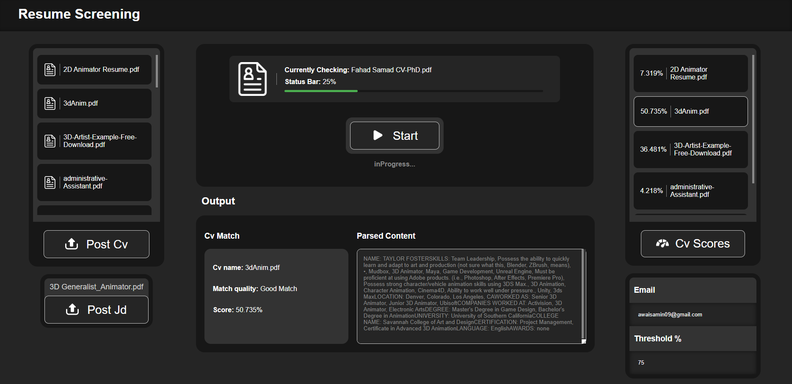

# Resume Parser and Similarity Scorer Calculator
V1.0
## Introduction

The Resume Parser and Similarity Scorer is a tool designed to streamline the hiring process by comparing resumes (CVs) against a provided job description (JD) and generating a similarity score. This documentation outlines the setup, configuration, and usage of the system.

## Features

- CV Queue for parsing
- NLP Model for checking Similarity Score
- Email notification upon successful CV processing
- User-friendly interface
- Web-based project

## Tools

This project utilizes the following technologies:

- HTML
- CSS
- JavaScript
- TensorFlow
- PyTorch
- Flask

## Sample JDs and CVs

Sample job descriptions (JDs) and CVs are provided in the following directories:

- JDs: `models/Examples/JD/`
- CVs: `models/Examples/CV/`

## Setup

1. **Model Download**: Get the model from Google Drive: [Model Link](https://drive.google.com/file/d/1LRavMaYRZibO_-Z9bh3306C79oxzdP4C/view?usp=sharing)

2. **Flask URL Configuration**: Update the Flask URL configuration in the `jscode.js` file located at `static/js/jscode.js` to match your server's base URL. Also, remember to change the `base` variable in `model.ipynb` for loading the MODEL.

3. **Threshold Configuration**: The threshold for considering a resume suitable is set to 70% in `model.ipynb`. To adjust the threshold, locate the relevant line in the `model.ipynb` file.

4. **Email Notification Configuration**: Provide the sender's email and password in the `model.ipynb` file and uncomment the `sendemail()` function where you see the "ENTER EMAIL PLEASE" comment. Follow the provided steps to configure your Gmail Account.

    - **Gmail Account Configuration**: Enable "Less secure app access" in your Google Account settings if you want to use it as a email sender account.

## Usage

1. **Uploading Resumes**: Upload resumes (CVs), JDs, threshold, and email to the system using the provided user interface.

2. **Providing Job Description**: Use detailed JDs and avoid including excessively long CVs, as the model might struggle with them.

3. **Scoring Resumes**: The system will analyze each resume against the provided job description (JD) and generate a similarity score.

## Note

Support The Project
