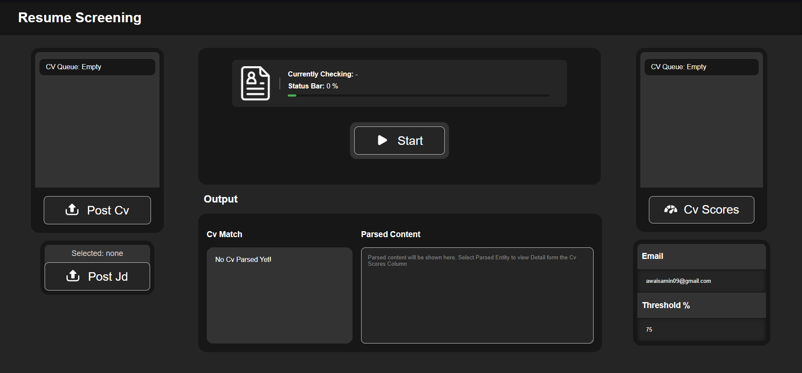

#Introduction:

The Resume Parser and Similarity Scorer is a tool designed to streamline the hiring process by comparing resumes (CVs) against a provided job description (JD) and generating a similarity score. This documentation outlines the setup, configuration, and usage of the system.

#Features:
CV Queue to parse ,
NLP Model to check Similarity Socre,
Recive email on a success CV,
Userfriendely interface,
Web-base project.

#Tools:
HTML, CSS, JS, tencerflow, Pytorch and Flask

#Sample JDs and CVs:
samples are located in models/Examples/JD/ and  models/Examples/CV/

#Setup:
get Model link Google drive => "https://drive.google.com/file/d/1LRavMaYRZibO_-Z9bh3306C79oxzdP4C/view?usp=sharing"

Flask URL Configuration:
Update the Flask URL configuration in the jscode.js file located at static/js/jscode.js to match your server's base URL. and do remember to change base varible in model.ipynb for loading the MODEL

javascript
Copy code
// Update the base_url variable with your Flask server's URL
var base_url = "http://your-flask-server-url";
Threshold Configuration:
The threshold for considering a resume suitable is set to 70% in model.ipynb . If a CV surpasses this threshold, an email notification will be triggered. To adjust the threshold, locate the following line in the model.ipynb file:

Email Notification Configuration:
To receive email notifications, provide the sender's email and password in the model.ipynb file and uncomment the sendemail() function where you see the "ENTER EMAIL PLEASE" comment. Follow the steps below to configure your Gmail Account. 

Gmail account:

Enable "Less secure app access" in your Google Account settings:
Go to your Google Account settings.
Navigate to the "Security" section.
Find "Less secure app access" and turn it on.
Note: Enabling less secure app access makes your account less secure, so exercise caution and only use it if you understand the implications.

Usage:

Uploading Resumes:
Upload resumes (CVs), (JD),Threshold and email to the system using the provided user interface. 

Providing Job Description:
Use Detailed JD and try not to include a too long CV Model might Struggle  with it.

Scoring Resumes:
The system will analyze each resume against the provided job description (JD) and generate a similarity score.

#Note !
Support The Project
